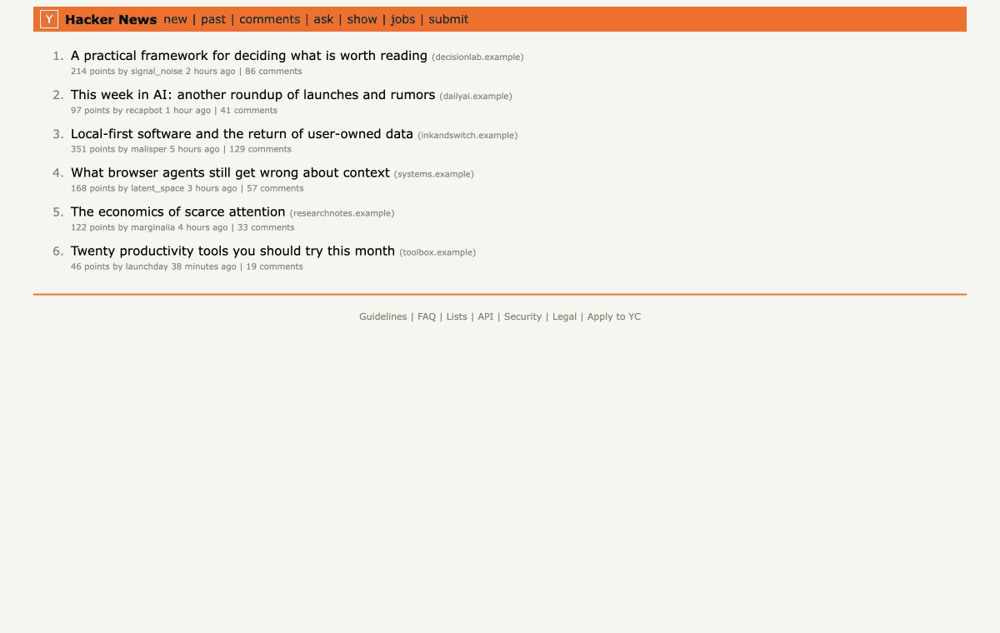

# Attention

**A local-first Chrome extension that estimates whether an article is worth your attention right now.**

[Website](https://giwwi.github.io/attention/) · [Download the extension](https://github.com/giwwi/attention/releases/latest/download/attention-extension-v0.21.12.zip)



Attention combines the article, your current goal, and your available time to produce a 0–100 Utility Score and one of four decisions: **Read, Skim, Save, or Skip**. Unlike a summarizer, it tries to predict personal usefulness before you spend time reading—and learns from whether the material was actually useful afterward.

The extension works without an account, analytics, or AI. An optional Vercel AI Gateway connection can provide a deeper analysis with a model selected by the user; `google/gemini-2.5-flash-lite` is the default suggestion.

## Try it in Chrome

1. Download and unzip the [latest release](../../releases/latest).
2. Open `chrome://extensions`.
3. Enable **Developer mode**.
4. Click **Load unpacked** and select the unzipped `attention-extension` folder.
5. Pin **Attention**, open an article, and click the extension icon.

No API key is required for the local evaluation. To try the optional AI analysis, open **Settings → AI analyzer**, paste a Vercel AI Gateway key, and keep the suggested Gemini model or enter another `provider/model` identifier.

## What it does

- Evaluates an article relative to your current **Work, Learn, Explore, or Relax** context.
- Explains the result through relevance, novelty, actionability, and argument quality.
- Shows lightweight previews on article titles and a detailed card on the open article.
- Lets you save an article or jump directly to recommended sections.
- Asks whether the material was worth the time and calibrates later predictions locally.
- Optionally uses local evidence from browser history, Readwise, Obsidian, and Notion.
- Supports English, Russian, German, Spanish, French, Italian, Simplified Chinese, Arabic, and Hindi.

## Privacy model

Attention is local-first:

- No account or analytics are required.
- Your profile, decisions, feedback, saved items, and source indexes stay in Chrome.
- Local evaluation never sends article content anywhere.
- External AI runs only after an explicit user action.
- Only the current article and a small locally selected context are sent to the chosen model.
- Readwise highlights, Obsidian notes, Notion pages, raw history, and the complete personal profile are never sent to AI.
- **Delete all Attention data** removes local data and connected keys.

The current prototype requests access to ordinary web pages so it can show title previews and end-of-reading feedback without opening the popup. Chrome describes this broadly as permission to “read and change your data on all websites.” Attention uses it only to extract the current page and render its own isolated UI. You can restrict site access in Chrome's extension settings.

## Build from source

Requirements: Node.js 20+ and pnpm 9+.

```bash
pnpm install
pnpm check
```

The production extension is created in `dist/`:

```bash
pnpm build
```

Load `dist/` through `chrome://extensions` → **Load unpacked**.

Useful commands:

```bash
pnpm test          # unit and integration tests
pnpm check:e2e     # browser-level extension tests
pnpm preview       # local UI preview on http://127.0.0.1:4173
pnpm check:real    # extraction checks against current HN links
```

## How it works

Mozilla Readability extracts the article. A local analyzer calculates the recommendation from inspectable heuristics. The optional AI analyzer returns structured evidence, but the final Utility Score and product policy remain in code. Results, decisions, and later usefulness ratings are connected by canonical URL in a bounded local memory.

The core loop is:

```text
Current context + content → predicted utility → decision → actual utility
```

See [PRODUCT.md](PRODUCT.md) for the product model, architecture, privacy boundaries, scoring assumptions, and known limitations.

## Status

Attention is an early functional prototype. It has not been published to the Chrome Web Store and its recommendations are estimates—not fact-checking or a guarantee that a source is correct. Feedback and reproducible bug reports are welcome through GitHub Issues.
